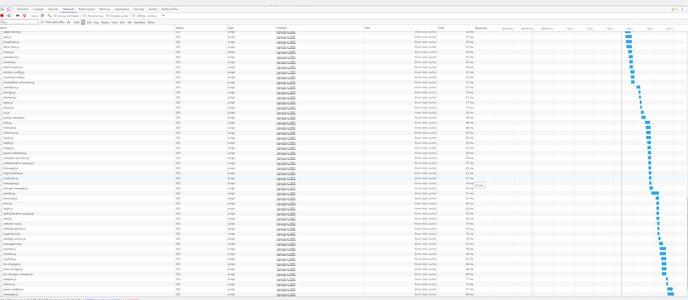
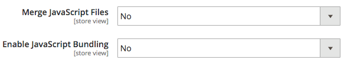
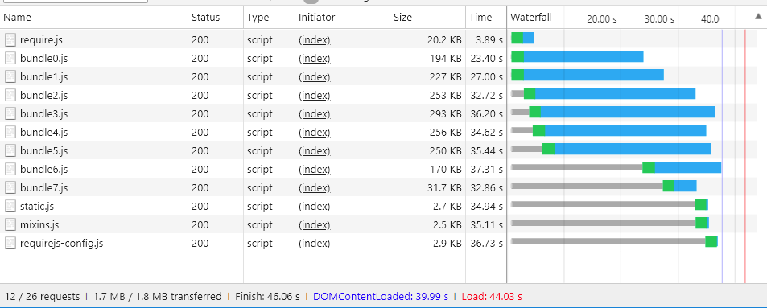

## Introduction

Bundling JavaScript modules for better performance is about reducing two things:

1. The number of server requests.
1. The size of those server requests.

In a modular application, the number of server requests can reach into the hundreds. For example, the following screen shot shows only the start of the list of JavaScript modules loaded on the home page of a clean Magento installation.



### Magento merging and bundling

Out of the box, Magento provides two ways to reduce the number of server requests: merging and bundling. These settings are turned off by default. You can turn them on within Magento's Admin UI in **Stores** > **Settings** > **Configuration** > **Advanced** > **Developer** > **JavaScript Settings**, or from the command line.



#### Basic bundling

To enable Magento's built-in bundling from the command line:

```bash
php -f bin/magento config:set dev/js/enable_js_bundling 1
```

This is a native Magento mechanism that combines all assets present in the system and distributes them among same-sized bundles (bundle_0.js, bundle_1.js ... bundle_x.js):


Better, but the browser still loads ALL the JavaScript bundles, not just the ones needed.

Magento bundling reduces the number of connections per page, but for each page request it loads all bundles, even when the requested page may only depend on files within one or two of the bundles. Performance improves after the browser caches the bundles. But, because the browser loads these bundles synchronously, the user's first visit to a Magento storefront could take a while to render and hurt the user experience.

#### Basic merging

To enable Magento's built-in merging from the command line:

```bash
php -f bin/magento config:set dev/js/merge_files 1
```

This command merges all synchronous JavaScript files into one file. Enabling merging without also enabling bundling is not useful because Magento uses RequireJS. If you don't enable bundling, Magento only merges RequireJS and its configuration. When you enable both bundling and merging, Magento creates a single JavaScript file:


### Real-world render times

The previous bundled and merged load times look great in a development environment. But in the real world, many things can slow down rendering: slow connections, large connection thresholds, limited networks. In addition, mobile devices do not render as fast as desktops.

To test and prepare your storefront deployment for the real world, we recommend you test with Chrome's native throttling profile of "Slow 3G." With Slow 3G, our previous bundled output times now reflect many users' connection realities:



At Slow 3G connectivity, it takes about 44 seconds to load all the bundles for the homepage of a clean Magento installation.

The same is true when merging the bundles into a single file. Users could still wait around 42 seconds for the initial page load as shown here:


With a more advanced approach to JavaScript bundling, we can improve these load times.

## Advanced bundling

Remember, the goal of JavaScript bundling is to reduce the number and size of requested assets for each page loaded in the browser. To do that, we want to build our bundles so that each page in our store will only need to download a common bundle and a page-specific bundle for each page accessed.

One way to achieve this is to define your bundles by page types. You can categorize Magento's pages into several page types, including Category, Product, CMS, Customer, Cart, and Checkout. Each page categorized into one of these page types has a different set of RequireJS module dependencies. When you bundle your RequireJS modules by page type, you will end up with only a handful of bundles that cover the dependencies of any page in your store.

For example, you might end up with a bundle for the dependencies common to all pages, a bundle for CMS-only pages, a bundle for Catalog-only pages, another bundle for Search-only pages, and a bundle for Checkout pages.

You could also create bundles by purpose:  for common features, product-related features, shipping features, checkout features, taxes, and form validations. How you define your bundles is up to you and the structure of your Magento store. You may find that some bundling strategies will work better than others.

A clean Magento installation allows reaching enough good performance by splitting bundles by page types, but some customizations may require deeper analysis and other asset distributions.

### Required tools

The following steps require you to install and have familiarity with the following tools:

-  [nodejs](https://nodejs.org/en/download/)
-  [r.js](http://requirejs.org/docs/optimization.html#download)
-  [PhantomJS](http://phantomjs.org/) (optional)

### Sample code

Full versions of the sample code used in this article are available here:

-  [build.js](samples/build.js){:target="_blank"}
-  [deps.js](samples/deps.js){:target="_blank"}
-  [deps-map.sh](samples/deps-map.sh.txt){:target="_blank"}

### Part 1: Create a bundling configuration

#### 1\. Add a build.js file

Create a `build.js` file in the Magento root directory. This file will contain the entire build configuration for your bundles.

```javascript
({
    optimize: 'none',
    inlineText: true
})
```

Later, we will change the `optimize:` setting from_ `none` to `uglify2` to minify bundle output. But for now, during development, you can leave it set to `none` to  ensure faster builds.

#### 2\. Add RequireJS dependencies, shims, paths, and map

Add the following RequireJS build configuration nodes, `deps`, `shim`, `paths`, and `map`, to your build file:

```javascript
({
    optimize: 'none',
    inlineText: true,

    deps: [],
    shim: {},
    paths: {},
    map: { "*": {} },
})
```

#### 3\. Aggregate the requirejs-config.js instance values

In this step, you will need to aggregate all of the multiple `deps`, `shim`, `paths`, and `map` configuration nodes from your store's `requirejs-config.js` file into the corresponding nodes in your `build.js` file. To do this, you can open the **Network** tab in your browser's Developer Tools panel and navigate to any page in your store, such as the homepage. In the Network tab, you will see your store's instance of the `requirejs-config.js` file near the top, highlighted here:


Within this file, you will find multiple entries for each of the configuration nodes (`deps`, `shim`, `paths`, `map`). You need to aggregate these multiple node values into your build.js file's single configuration node. For example, if your store's `requirejs-config.js` instance has entries for 15 separate `map` nodes, you will need to merge the entries for all 15 nodes into the single `map` node in your `build.js` file. The same will be true for the `deps`, `shim`, and `paths` nodes. Without a script to automate this process, it may take time.

You will need to change the path `mage/requirejs/text` to `requirejs/text` in `paths` configuration node as following:

```javascript
({
    //...
    paths: {
        //...
        "text": "requirejs/text"
    },
})
```

#### 4\. Add a modules node

At the end of the `build.js` file, add the modules[] array as a placeholder for the bundles you will define for your storefront later.

```javascript
({
    optimize: 'none',
    inlineText: true,

    deps: [],
    shim: {},
    paths: {},
    map: { "*": {} },

    modules: [],
})
```

#### 5\. Retrieve RequireJS dependencies

You can retrieve all the RequireJS module dependencies from your store's page types by using:

1. PhantomJS from the command line (assuming you have PhantomJS installed).
1. RequireJS command in your browser's console.

#### To use PhantomJS:

In the Magento root directory, create a new file called `deps.js` and copy in the code below. This code uses PhantomJS to open a page and wait for the browser to load all page assets. It then outputs all the RequireJS dependencies for a given page.

```javascript
"use strict";
var page = require('webpage').create(),
    system = require('system'),
    address;

if (system.args.length === 1) {
    console.log('Usage: $phantomjs deps.js url');
    phantom.exit(1);
} else {
    address = system.args[1];
    page.open(address, function (status) {
        if (status !== 'success') {
            console.log('FAIL to load the address');
        } else {
            setTimeout(function () {
                console.log(page.evaluate(function () {
                    return Object.keys(window.require.s.contexts._.defined);
                }));
                phantom.exit();
            }, 5000);
        }
    });
}
```

Open a terminal inside the Magento root directory and run the script against each page in your Magento store that represents a specific page type:

<pre>
phantomjs deps.js <i>url-to-specific-page</i> > <i>text-file-representing-pagetype-dependencies</i>
</pre>

For example, here are four pages from the Luma themed sample Magento store that represent the four page types we will use to create our four bundles (homepage, category, product, cart):

```terminal
phantomjs deps.js http://m2.loc/ > bundle/homepage.txt
phantomjs deps.js http://m2.loc/women/tops-women/jackets-women.html > bundle/category.txt
phantomjs deps.js http://m2.loc/beaumont-summit-kit.html > bundle/product.txt
phantomjs deps.js http://m2.loc/checkout/cart/?SID=m2tjdt7ipvep9g0h8pmsgie975 > bundle/cart.txt (prepare a shopping cart)
..............
```

#### To use the browser console:

If you don't want to use PhantomJS, you can run the following command from your browser's console while viewing each page type in your storefront:

```shell
Object.keys(window.require.s.contexts._.defined)
```

This command (used within the PhantomJS script) creates the same list of RequireJS dependencies and displays them within the browser's console. The disadvantage of this approach is that you will have to create your own bundle/page-type text files.

#### 6\. Format and filter the output

After you merge the RequireJS dependencies into page-type text files, you can use the following command on each page-type dependency file to replace the commas in your files with newlines:

```terminal
sed -i -e $'s/,/\\\n/g' bundle/category.txt
sed -i -e $'s/,/\\\n/g' bundle/homepage.txt
sed -i -e $'s/,/\\\n/g' bundle/product.txt
....
```

You should also remove all the mixins for each file because mixins duplicate dependencies. Use the following command on each dependency file:

```terminal
sed -i -e 's/mixins\!.*$//g' bundle/homepage.txt
sed -i -e 's/mixins\!.*$//g' bundle/category.txt
sed -i -e 's/mixins\!.*$//g' bundle/product.txt
...
```

#### 7\. Identify unique and common bundles

The goal is to create a common bundle of JavaScript files needed by all pages. That way the browser only needs to load the common bundle along with one or more specific page types.

Open a terminal in the Magento root directory and use the following command to verify that you have dependencies you can split into separate bundles:

```bash
sort bundle/*.txt |uniq -c |sort -n
```

This command merges and sorts the dependencies found in the `bundle/*.txt` files.  The output also shows the number of files that contain each dependency:

```terminal
1 buildTools,
1 jquery/jquery.parsequery,
1 jsbuild,
2 jquery/jquery.metadata,
2 jquery/validate,
2 mage/bootstrap,
3 jquery
3 jquery/ui
3 knockoutjs/knockout
...
```

This output shows that `buildTools` is a dependency in only one of the bundle/*.txt files. The `jquery/jquery.metadata` dependency is in two (2) files and `es6-collections` is in three (3) files.

Our output shows only three page types (homepage, category, and product), which tells us:

-  Three dependencies are unique to only one page type (shown by the number 1).
-  Three more dependencies occur on two page types (shown by the number 2).
-  The last three dependencies are common to all three of our page types (shown by the number 3).

This tells us that we can likely improve our store's page-loading speeds by splitting our dependencies into different bundle, once we know which page types need which dependencies.

#### 8\. Create a dependencies distribution file

To find out which page types need which dependencies, create a new file in the Magento root directory called `deps-map.sh` and copy in the code below:

```shell
awk 'END {
 for (R in rec) {
   n = split(rec[R], t, "/")
   if (n > 1)
     dup[n] = dup[n] ? dup[n] RS sprintf("\t%-20s -->\t%s", rec[R], R) : \
       sprintf("\t%-20s -->\t%s", rec[R], R)
   }
 for (D in dup) {
   printf "records found in %d files:\n\n", D
   printf "%s\n\n", dup[D]
   }
 }
{
 rec[$0] = rec[$0] ? rec[$0] "/" FILENAME : FILENAME
}' bundle/*.txt
```

You can also find the script at [https://www.unix.com/shell-programming-and-scripting/140390-get-common-lines-multiple-files.html](https://www.unix.com/shell-programming-and-scripting/140390-get-common-lines-multiple-files.html)

Open a terminal in the Magento root directory and run the file:

```bash
bash deps-map.sh
```

The output from this script, applied to our three example page types, should look something like this (but much longer):

```terminal
bundle/product.txt   -->   buildTools,
bundle/category.txt  -->   jquery/jquery.parsequery,
bundle/product.txt   -->   jsbuild,

bundle/category.txt/bundle/homepage.txt -->    jquery/jquery.metadata,
bundle/category.txt/bundle/homepage.txt -->    jquery/validate,
bundle/category.txt/bundle/homepage.txt -->    mage/bootstrap,

bundle/category.txt/bundle/homepage.txt/bundle/product.txt --> jquery,
bundle/category.txt/bundle/homepage.txt/bundle/product.txt --> jquery/ui,
bundle/category.txt/bundle/homepage.txt/bundle/product.txt --> knockoutjs/knockout,
```

This is enough information to build a bundles configuration.

#### 9\. Create bundles in your build.js file

Open the `build.js` configuration file and add your bundles to the `modules` node. Each bundle should define the following properties:

-  `name`— the name of the bundle. For example, a name of `bundles/cart` generates a `cart.js` bundle in a `bundles` subdirectory.

-  `create`— a boolean flag to create the bundle (values: `true` or `false`).

-  `include`— an array of assets (strings) included as dependencies for the page. RequireJS traces all dependencies and includes them in the bundle unless excluded.

-  `exclude`— an array of bundles or assets to exclude from the bundle.

```javascript
{
    name: 'bundles/catalog',
    create: true,
    include: [
        'addToWishlist',
        'priceBundle',
        'priceUtils',
        'priceOptions',
        'sticky',
        'productSummary',
        'slide'
    ],
    exclude: [
        'requirejs/require',
        'bundles/default',
        'mage/bootstrap'
    ],
}
```

This example reuses `mage/bootstrap` and `requirejs/require` assets, placing higher priority on their most important components and components that have to be loaded synchronously. The bundles that are present are:

-  `requirejs/require`—the only synchronously loaded bundle
-  `mage/bootstrap`—the bootstrap bundle with UI components
-  `bundles/default`—default bundle required for all pages
-  `bundles/cart`—a bundle required for cart page
-  `bundles/shipping`—common bundle for shopping cart and checkout page (assuming that checkout is never opened directly the checkout page loads even faster if cart page was opened previously and the shipping bundle was already loaded)
-  `bundles/checkout`—everything for checkout
-  `bundles/catalog`—everything for product and category pages

### Part 2: Generate bundles

The steps below describe the basic process for generating more efficient Magento bundles. You can automate this process any way you want, but you will still need to use `nodejs` and `r.js` to actually generate your bundles. And if your themes have JavaScript-related customizations and cannot reuse the same `build.js` file, you may need to create several `build.js` configurations per theme.

#### 1. Generate static store sites

Before generating bundles in Magento, run the static deployment command:

```bash
php -f bin/magento setup:static-content:deploy -f -a frontend
```

This command generates static store deployments for each theme and locale you have set up. For example, if you use the Luma theme and a custom theme with locales in English and French, you would generate four static deployments:

-  ...luma/en_US
-  ...luma/fr_FR
-  ...custom/en_US
-  ...custom/fr_FR

To generate bundles for all store themes and locales, repeat the steps below for each store theme and locale.

#### 2. Move the static store content to a temp directory

First, you need to move the static content from the target directory to some temporary directory because RequireJS replaces all the content within the target directory.

```bash
mv pub/static/frontend/Magento/{theme}/{locale} pub/static/frontend/Magento/{theme}/{locale}_tmp
```

For example:

```bash
mv pub/static/frontend/Magento/luma/en_US pub/static/frontend/Magento/luma/en_US_tmp
```

#### 3. Run the r.js optimizer

Then run the r.js optimizer on the `build.js` file from Magento's root directory. Paths to all directories and files are relative to the working directory.

```bash
r.js -o build.js baseUrl=pub/static/frontend/Magento/luma/en_US_tmp dir=pub/static/frontend/Magento/luma/en_US
```

This command generates bundles in a `bundles` subdirectory of the target directory, which in this case results in `pub/static/frontend/Magento/luma/en_US/bundles`.

Listing the contents of the new bundle directory might look like this:

```bash
ll pub/static/frontend/Magento/luma/en_US/bundles
```

```terminal
total 1900
drwxr-xr-x  2 root root    4096 Mar 28 11:24 ./
drwxr-xr-x 70 root root    4096 Mar 28 11:24 ../
-rw-r--r--  1 root root  116417 Mar 28 11:24 cart.js
-rw-r--r--  1 root root  187090 Mar 28 11:24 catalog.js
-rw-r--r--  1 root root  307619 Mar 28 11:24 checkout.js
-rw-r--r--  1 root root 1240608 Mar 28 11:24 default.js
-rw-r--r--  1 root root   74233 Mar 28 11:24 shipping.js
```

#### 4. Configure RequireJS to use bundles

To get RequireJS to use your bundles, add a `onModuleBundleComplete` callback after the `modules` node in the `build.js` file:

```javascript
[
    {
       //...
       exclude: [
           'requirejs/require',
           'bundles/default',
           'bundles/checkout',
           'bundles/cart',
           'bundles/shipping',
           'mage/bootstrap'
       ],
   },
],
bundlesConfigOutFile: `${config.dir}/requirejs-config.js`,
onModuleBundleComplete: function(data) {
    if (this.bundleConfigAppended) {
        return;
    }
    this.bundleConfigAppended = true;

    // bundlesConfigOutFile requires a simple require.config call in order to modify the configuration
    const bundleConfigPlaceholder = `
(function (require) {
require.config({});
})(require);
    `;

    fs.appendFileSync(this.bundlesConfigOutFile, bundleConfigPlaceholder);
}
```

#### 5. Rerun deploy command

Run the following command to deploy:

```bash
r.js -o app/design/frontend/Magento/luma/build.js baseUrl=pub/static/frontend/Magento/luma/en_US_tmp dir=pub/static/frontend/Magento/luma/en_US
```

Open `requirejs-config.js` in the `pub/static/frontend/Magento/luma/en_US` directory to verify that RequireJS appended the file with bundling configuration calls:

```javascript
require.config({
    bundles: {
        "bundles/default": ["mage/template", "mage/apply/scripts", "mage/apply/main", "mage/mage", "mage/translate", "mage/loader"],
        "bundles/cart": ["Magento_Ui/js/lib/validation/utils", "Magento_Ui/js/lib/validation/rules", "Magento_Ui/js/lib/validation/validation"]
    }
}
```

{:.bs-callout-info}
When configuring bundles, make sure you put the `requirejs.config()` calls in the order you want them executed, as the calls are executed in the order they appear.

#### 6. Test the results

After the page loads, notice the browser loading different dependencies and bundles. For example, here are the results for 'Slow 3G' profile:


The page load time for an empty homepage is now twice as fast than using native Magento bundling. But we can do even better.

#### 7. Optimize the bundles

Even if gzipped, the JavaScript files are still large. Minify them with RequireJS, which uses uglifier for minifying JavaScript to good result.

To enable the optimizer in your `build.js` file, add `uglify2` as the value for the optimize property at the top of the `build.js` file:

```javascript
({
    optimize: 'uglify2',
    inlineText: true
})
```

The results can be significant:


The load times are now three times faster than with native Magento bundling.
