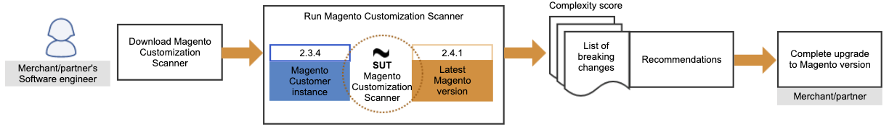

Welcome to the Magento Safe Upgrade Tool (SUT).

SUT is a CLI tool that checks a magento instance against a specific version by analysing all the non-magento modules installed in it.

## SUT Workflow

The following diagram shows the expected workflow when running SUT:

> Example of the SUT workflow



## Prerequisites

See the [prerequisites checklist for SUT]({{page.baseurl}}/guides/v2.4/comp-mgr/sut/prereq-sut-checklist.html) for the minimum requisites required to run SUT.

{:.bs-callout .bs-callout-info}
SUT should run in any operating system. It is not required to run the tool where your magento instance is located.

## SUT installation 

In order to install SUT, it is required that you check/install the necessary prerequisites mentioned earlier:

- Magento access keys
- Composer
- Node.js

### Magento access keys

Check that you have the **Magento access keys** in your system. If you do not have them, create an account at the [Magento marketplace](https://marketplace.magento.com/).

Then, you will be able to create the **Magento access keys**.

See the [Access keys guide]({{page.baseurl}}/marketplace/sellers/profile-information.html) topic for more information on creating access keys.

Once you create the access keys, add them to your `auth.json` file, which is located by default in your `~/.composer` folder.

{:.bs-callout .bs-callout-warning}
Check your **COMPOSER_HOME** environment variable to see where the `auth.json` file is located.

The **public key** corresponds to the _username_ whereas the **private key** is the _password_:

> Example of Magento access keys

```json
    "http-basic": {
        "repo.magento.com": {
            "username": "YOUR_MAGENTO_PUBLIC_KEY",
            "password": "YOUR_MAGENTO_PRIVATE_KEY"
        }
    },
```

### Composer

Clone this repository and, from the **safe-upgrade-tool** folder run `composer install` in your terminal to install its dependencies. 

{:.bs-callout .bs-callout-warning}
If the **Magento access keys** are not correctly configured, SUT will not be fully installed and you will get errors when running the `composer install` command in your terminal.

### Node.js

To install _Node.js_ in your system, check the [_Node.js_](https://nodejs.dev/learn/how-to-install-nodejs) page for more information.

## Third-party extensions

Magento recommends that you contact your search engine vendor to determine whether your extension is fully compatible with Magento 2.4.

See the [use SUT guide]({{page.baseurl}}/guides/v2.4/comp-mgr/sut/use-sut-guide.html) for information about running SUT.