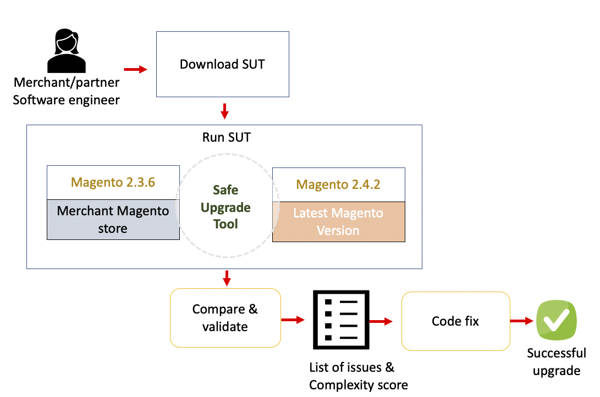
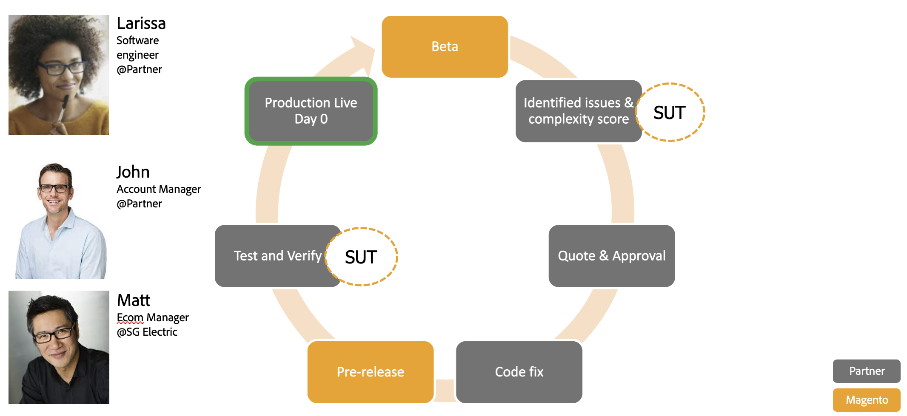

The Safe Upgrade Tool ALPHA (SUT) is a command line (CLI) tool that checks a Magento instance against a specific version by analyzing all the non-Magento modules installed on it.

{:.bs-callout-warning}
At the moment this is an ALPHA version with limited scope, available for all Magento Commerce merchants, only validating PHP Magento APIs and GraphQL schema.

## Workflow

The following diagram shows the expected workflow when running the SUT:



### Who is the SUT for?

The following use case describes the typical process for a Magento partner to upgrade a client's Magento instance:

1. A partner's Software Engineer downloads the SUT package from the [Magento repository](https://repo.magento.com/) and executes it during the beta phase of the newest Magento release.
1. The Software Engineer sees that there are several customized areas broken in the inventory and catalog modules and they also get a complexity score of X. See the [Developer information guide]({{site.baseurl}}/safe-upgrade-tool/developer.html) for more information on the complexity score.
1. With this information, the Software Engineer is able to understand the complexity of the upgrade and is able to relay this information back to the partner's Account Manager.
1. The Account Manager creates a timeline and cost for the Magento upgrade, which allows them to get their manager's approval.
1. With their manager's approval, the Software Engineer works on the required code modifications to fix the broken modules.
1. The Software Engineer runs the SUT tool one more time with a Magento pre-release to ensure there are no new issues and that their code changes fixed the problems found during the beta phase.
1. Everything check’s out and the Software Engineer pushes the code to a staging environment where regression tests confirm all tests are green, which allows them to release the latest Magento version to production the same day that the Magento pre-release is released.



## Prerequisites

See [prerequisites]({{site.baseurl}}/safe-upgrade-tool/prerequisites.html) for more information.

{:.bs-callout-info}
You can run the SUT in any operating system. There is no requirement to run the SUT where your Magento instance is located. It is necessary for SUT to have access to the source code of the Magento instance. For example, you can install the SUT on one server and point it at your Magento installation on another server.

If you are running SUT against a Magento customized instance with large third-party modules and files, the tool might require a high amount of RAM, at least 2GB RAM.

### Recommended actions

Magento best practice is not to have 2 modules with the same name, if this happens SUT will show a segmentation fault error in which case you have to analyze each module independently with the option `-m`:

  ```bash
  bin/sut upgrade:check /(instance_path) --coming-version=2.4.1 -m /(module_path)
  ```

If you get memory issues while executing SUT it is recommended to use the `-m` command to run the tool against a specific module.

## Install

To install the SUT, you must install the necessary prerequisites:

*  Magento access keys
*  Composer
*  Node.js (only required to check GraphQL compatibility)

Refer to the [SUT installation]({{site.baseurl}}/safe-upgrade-tool/install.html#install).

### Magento access keys

You must have [Magento access keys]({{site.baseurl}}/marketplace/sellers/profile-information.html#access-keys) to download and use the SUT. Add your Magento access keys to your `auth.json` file, which is located at `~/.composer` by default.

{:.bs-callout-warning}
Check your **COMPOSER_HOME** environment variable to see where the `auth.json` file is located.

The **public key** corresponds to the _username_ whereas the **private key** is the _password_:

### Example of Magento access keys

```json
    "http-basic": {
        "repo.magento.com": {
            "username": "YOUR_MAGENTO_PUBLIC_KEY",
            "password": "YOUR_MAGENTO_PRIVATE_KEY"
        }
    },
```

### Composer

Clone the [safe-upgrade-tool](https://github.com/magento-commerce/safe-upgrade-tool) repository and run `composer install` in your terminal to install dependencies.

{:.bs-callout-warning}
If the **Magento access keys** are not correctly configured, the SUT will not install and you will get errors when running the `composer install` command.

### Node.js

To install Node.js, see the Node.js [documentation](https://nodejs.dev/learn/how-to-install-nodejs).

{:.bs-callout-info}
Node.js is only a requirement to check GraphQL compatibility.

## Third-party extensions

Magento recommends that you contact your search engine vendor to determine whether your extension is fully compatible with Magento 2.4.

See [Run the tool]({{site.baseurl}}/safe-upgrade-tool/run.html) for information about executing the SUT tool.