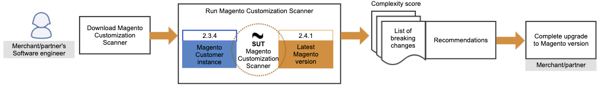

SUT is a CLI tool that checks a magento instance against a specific version by analysing all the non-magento modules installed in it.

## Workflow

The following diagram shows the expected workflow when running SUT:



### Who is the SUT for?

A main use case for SUT describes the regular process for a magento partner to upgrade one of their Magento instances:

1. A partner's software engineer downloads the SUT and executes it during the beta phase of the newest Magento release.
1. Then, the engineer sees that there are several customized areas broken in the inventory and catalog modules, and she also gets a complexity score of X. See the [Developer information guide]({{ site.baseurl }}/safe-upgrade-tool/developer.html) for more information on the complexity score.
1. With this information, the engineer is able to understand the complexity of the upgrade and is able to relay this information back to the partner's account manager.
1. The account manager creates a timeline and cost for the Magento upgrade which allows them to get their managers approval.
1. With their managers approval, the software engineer works on the required code modifications to fix the broken modules.
1. With Magento pre-releases, run the SUT tool one more time to ensure there were no new issues and her code changes fixed the problems found during the beta phase.
1. Everything check’s out and she will push the code to Staging where the automated tests will confirm all tests are green which will allow them to release the latest Magento version to Production the same day as Magento pre-release is released.

## Prerequisites

See the [prerequisites checklist for SUT]({{ site.baseurl }}/safe-upgrade-tool/prerequisites.html) for the minimum requisites required to run SUT.

{:.bs-callout-info}
SUT should run in any operating system. It is not required to run the tool where your magento instance is located.

## Install

In order to install SUT, it is required that you check/install the necessary prerequisites mentioned earlier:

*  Magento access keys
*  Composer
*  Node.js

### Magento access keys

Check that you have the **Magento access keys** in your system. If you do not have them, create an account at the [Magento marketplace](https://marketplace.magento.com/).

Then, you will be able to create the **Magento access keys**.

See the [Access keys guide]({{ site.baseurl }}/marketplace/sellers/profile-information.html) topic for more information on creating access keys.

Once you create the access keys, add them to your `auth.json` file, which is located by default in your `~/.composer` folder.

{:.bs-callout-warning}
Check your **COMPOSER_HOME** environment variable to see where the `auth.json` file is located.

The **public key** corresponds to the _username_ whereas the **private key** is the _password_:

### Example of Magento access keys

```json
    "http-basic": {
        "repo.magento.com": {
            "username": "YOUR_MAGENTO_PUBLIC_KEY",
            "password": "YOUR_MAGENTO_PRIVATE_KEY"
        }
    },
```

### Composer

Clone this repository and, from the **safe-upgrade-tool** folder run `composer install` in your terminal to install its dependencies.

{:.bs-callout-warning}
If the **Magento access keys** are not correctly configured, SUT will not be fully installed and you will get errors when running the `composer install` command in your terminal.

### Node.js

To install _Node.js_ in your system, check the [_Node.js_](https://nodejs.dev/learn/how-to-install-nodejs) page for more information.

## Third-party extensions

Magento recommends that you contact your search engine vendor to determine whether your extension is fully compatible with Magento 2.4.

See the [Run the tool guide]({{ site.baseurl }}/safe-upgrade-tool/run.html) for information about executing the SUT tool.