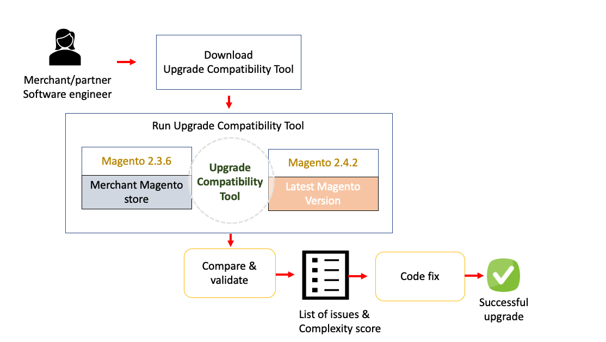

The {{site.data.var.uct}} is a command-line tool that checks an {{site.data.var.ee}} customized instance against a specific version by analyzing all modules installed in it. It returns a list of errors and warnings that must be addressed before upgrading to the latest version of {{site.data.var.ee}}.

## Workflow

The following diagram shows the expected workflow when running the {{site.data.var.uct}}:

{:height="80%" width="80%"}

## Who is the Upgrade Compatibility Tool for?

The following use case describes the typical process for an {{site.data.var.ee}} partner to upgrade a client's instance:

1. A partner's Software Engineer downloads the {{site.data.var.uct}} package from the [{{site.data.var.ee}} repository](https://repo.magento.com/) and executes it during the beta phase of the newest {{site.data.var.ee}} release. See the [Download the Upgrade Compatibility Tool](https://experienceleague.adobe.com/docs/commerce-operations/upgrade-guide/upgrade-compatibility-tool/install.html#download-the-upgrade-compatibility-tool) topic for more information.
1. The Software Engineer generates a vanilla instance for the specific version of {{site.data.var.ee}} that is currently installed. See the [Contributor guide]({{site.baseurl}}/contributor-guide/contributing.html#vanilla-pr) for more information on using the `instance` command to generate a vanilla installation.
1. The Software Engineer sees that there are several customized areas broken in the inventory and catalog modules and they also get a complexity score of X. See the [Developer](https://experienceleague.adobe.com/docs/commerce-operations/upgrade-guide/upgrade-compatibility-tool/developer.html) guide for more information on the complexity score.
1. With this information, the Software Engineer is able to understand the complexity of the upgrade and is able to relay this information back to the partner's Account Manager.
1. The Account Manager creates a timeline and cost for the {{site.data.var.ee}} upgrade, which allows them to get their manager's approval.
1. With their manager's approval, the Software Engineer works on the required code modifications to fix the broken modules.
1. The Software Engineer runs the {{site.data.var.uct}} one more time with an {{site.data.var.ee}} pre-release to ensure there are no new issues and that their code changes fixed the problems found during the beta phase.
1. Everything checks out and the Software Engineer pushes the code to a staging environment where regression tests confirm all tests are green, which allows them to release the latest {{site.data.var.ee}} version to production the same day that the {{site.data.var.ee}} pre-release is released.

{:height="80%" width="80%"}

{:.bs-callout-info}
A vanilla instance is a clean installation of a specified version tag or branch for a specific release version.

## Prerequisites

See [prerequisites](https://experienceleague.adobe.com/docs/commerce-operations/upgrade-guide/upgrade-compatibility-tool/prerequisites.html) for more information.

{:.bs-callout-info}
You can run the {{site.data.var.uct}} in any operating system. There is no requirement to run the {{site.data.var.uct}} where your {{site.data.var.ee}} instance is located. It is necessary for the {{site.data.var.uct}} to have access to the source code of the {{site.data.var.ee}} instance. For example, you can install the tool on one server and point it at your {{site.data.var.ee}} installation on another server.

If you are running the {{site.data.var.uct}} against an {{site.data.var.ee}} instance with large modules and files, the tool might require a high amount of RAM, at least 2GB RAM.

### Recommended actions

{{site.data.var.ee}} best practices recommend to avoid having two modules with the same name. If this happens, the {{site.data.var.uct}} will show a segmentation fault error.

To avoid this error it is recommended to run the `bin` command with the added option `-m`:

```bash
bin/uct upgrade:check /<dir>/<instance-name> --coming-version=2.4.1 -m /vendor/<vendor-name>/<module-name>
```

{:.bs-callout-info}
The `<dir>` value is the directory where your {{site.data.var.ee}} instance is located.

The `-m` option allows the {{site.data.var.uct}} to analyze each specific module independently to avoid encountering two modules with the same name in your {{site.data.var.ee}} instance.

This command option also allows the {{site.data.var.uct}} to analyze a folder containing several modules:

```bash
bin/uct upgrade:check /<dir>/<instance-name> --coming-version=2.4.1 -m /vendor/<vendor-name>/
```

This recommendation also helps with memory issues that can occur when executing the {{site.data.var.uct}}.

## Download the Upgrade Compatibility Tool

To download the {{site.data.var.uct}}, run the following command:

```bash
composer create-project magento/upgrade-compatibility-tool uct --repository https://repo.magento.com
```

## Install

To install the {{site.data.var.uct}}, you must install the necessary prerequisites:

*  {{site.data.var.ee}} access keys
*  Composer
*  Node.js

Refer to the [Upgrade Compatibility Tool install](https://experienceleague.adobe.com/docs/commerce-operations/upgrade-guide/upgrade-compatibility-tool/install.html#install) page.

### {{site.data.var.ee}} access keys

You must have [{{site.data.var.ee}} access keys]({{site.baseurl}}/marketplace/sellers/profile-information.html#access-keys) to download and use the {{site.data.var.uct}}. Add your {{site.data.var.ee}} access keys to your `auth.json` file, which is located at `~/.composer` by default.

{:.bs-callout-warning}
Check your **COMPOSER_HOME** environment variable to see where the `auth.json` file is located.

The **public key** corresponds to the _username_ whereas the **private key** is the _password_:

### Example of {{site.data.var.ee}} access keys

```json
    "http-basic": {
        "repo.magento.com": {
            "username": "YOUR_MAGENTO_PUBLIC_KEY",
            "password": "YOUR_MAGENTO_PRIVATE_KEY"
        }
    },
```

### Composer

Clone the {{site.data.var.uct}} repository and run `composer install` in your terminal to install dependencies.

{:.bs-callout-warning}
If the **{{site.data.var.ee}} access keys** are not correctly configured, the {{site.data.var.uct}} will not install and you will get errors when running the `composer install` command.

### Node.js

To install Node.js, see the Node.js [documentation](https://nodejs.dev/learn/how-to-install-nodejs).

## Third-party extensions

Adobe recommends that you contact your extension vendor to determine whether your extension is fully compatible with {{site.data.var.ee}} 2.4.x.

See [Run the tool](https://experienceleague.adobe.com/docs/commerce-operations/upgrade-guide/upgrade-compatibility-tool/run.html) for information about executing the {{site.data.var.uct}}.
